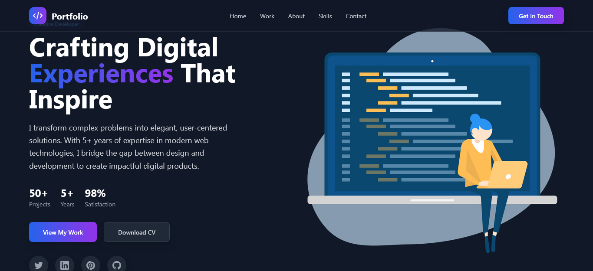

# 🚀 Larafolio — Laravel Full-Stack Portfolio System



**Larafolio** is a full-stack portfolio management system built with **Laravel**.  
It includes authentication, an admin panel, CRUD functionality for projects and skills, and an interactive board to visualize and manage your data — all designed for developers who want a professional, dynamic portfolio.

---

## 🧠 Features

- 🔐 **Authentication System**
  - Secure login & registration
  - User session management

- 🧭 **Admin Panel (Dashboard)**
  - Manage projects and skills in one place
  - View stats and activity overview

- ⚙️ **CRUD Operations**
  - Create, Read, Update, Delete projects
  - Create, Read, Update, Delete skills

- 🧱 **Board View**
  - Organized display for Projects and Skills
  - Quick access for editing or managing data

- 💅 **Responsive UI**
  - Clean, modern, and mobile-friendly design

---

## 🧰 Tech Stack

| Layer | Tech                                                |
|-------|-----------------------------------------------------|
| Backend | Laravel 9+                                          |
| Frontend | Blade / TailwindCSS / JS                            |
| Database | MySQL                                               |
| Authentication | Laravel Breeze / Sanctum                            |
| Deployment | Apache / Nginx / Docker (optional) /Artisan(Server) |

---

## ⚙️ Installation

### 1️⃣ Clone the Repository

```bash
git clone https://github.com/<your-username>/Larafolio.git
cd Larafolio
````

### 2️⃣ Install Dependencies

```bash
composer install
npm install && npm run dev
```

### 3️⃣ Environment Setup

Copy `.env.example` to `.env` and configure your database:

```bash
cp .env.example .env
```

Update the following in `.env`:

```
DB_CONNECTION=mysql
DB_HOST=127.0.0.1
DB_PORT=3306
DB_DATABASE=portfolio
DB_USERNAME=root
DB_PASSWORD=root
```

### 4️⃣ Generate Key & Migrate

```bash
php artisan key:generate
```

### 5️⃣ Run the Server

```bash
php artisan serve
```

Now open your browser at **[http://localhost:8000](http://localhost:8000)** 🎉

---

## 🧑‍💻 Admin Credentials (Demo)

```
Email: admin@example.com
Password: password
```

*(You can edit these in the seeder file if you want custom credentials.)*

---

## 📂 Project Structure

```
Larafolio/
├── app/
│   ├── Http/
│   ├── Models/
│   ├── Controllers/
├── database/
│   ├── migrations/
│   ├── seeders/
├── resources/
│   ├── views/
│   ├── css/
│   └── js/
└── routes/
    ├── web.php
```

---

## 📸 Screenshots

*(Add screenshots or GIFs of your dashboard, board, and CRUD pages here)*

---

## 🤝 Contributing

1. Fork the repository
2. Create your feature branch: `git checkout -b feature/AmazingFeature`
3. Commit your changes: `git commit -m 'Add AmazingFeature'`
4. Push to the branch: `git push origin feature/AmazingFeature`
5. Open a Pull Request

---

## 📜 License

This project is licensed under the **MIT License** — feel free to use and modify it.

---

## 🌟 Acknowledgments

Built with ❤️ by **Ahmed-Hamdy101**

> “Code your story. Craft your portfolio. Show your evolution.”
